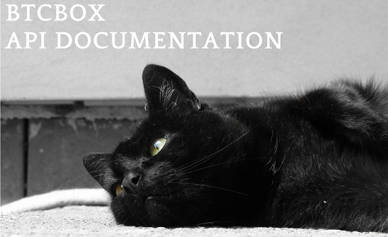

## Overview

はじめに[免責事項](doc/disclaimer.md)をお読みください。

### HTTP API

BTCBOX APIには、大きく2つのAPIが存在します。  
認証が不要な[HTTP Public API](doc/public.md)と、APIキーによる認証が必要な[HTTP Private API](doc/private.md)です。  

エンドポイントURL: https://www.btcbox.co.jp/api/v1

### Rate limiting

以下のHTTP APIは、呼び出し回数に制限があります。  
これら以外のHTTP APIには、呼び出し回数の制限はありません。ただし、システムに負荷がかかる呼び出しなどが行なわれた場合は、BTCBOX株式会社の判断でAPIの使用が制限される場合があります。  

| Request    | Description | Limit  |
|------------|-------------|--------|
| trade_add  | 新規注文        | 5回 / 秒 |
| trade_list | 注文情報の取得     | 3回 / 秒 |
| balance    | 残高情報の取得     | 5回 / 秒 |

### Authentication

HTTP Private APIを利用するには認証が必要です。  
[APIキーの取得](https://support.btcbox.co.jp/hc/ja/articles/360001889534-APIキー取得の手順)を参照して、APIの公開鍵と秘密鍵を取得します。  

> 【注意】  
> 秘密鍵が第三者に知られた場合、意図しない資産の操作・取引等が行われ、損害が発生する可能性があります。秘密鍵は、必ず安全な方法で管理する必要があります。  

#### signature

1. signature以外のパラメータを利用して、次のような文字列を生成する。（例：coin, key, nonce→coin=btc&key=<公開鍵>&nonce=1234567890）
2. 生成した文字列をMD5アルゴリズムでダイジェストした秘密鍵でHMAC-SHA256署名を行います。
3. signatureとその他のパラメータをHTTP APIへ送信します。

#### nonce

通常はUNIX時間で設定すれば問題ありません。  
なお、BTCBOXのシステムは同一UIDについてnonceが前回リクエストされたnonceより大きいことをチェックします。マルチスレッドプログラミングを行なう場合は注意が必要です。  

### Pagination

### Install request

以下のオペレーションで、サンプルコード（Python）を動作させるためのライブラリをインストールしてください。  

```shell
pip install --upgrade -r requirements.txt
```

### Reference

* BTCボックス株式会社(2022). BTCBOX API ドキュメント. https://blog.btcbox.jp/archives/8759 (Last accessed 2022/09/01)
